# GarbageSegregatio Application

## Description

The app, titled "GarbageSegregatio Application", aims to provide users with a convenient and efficient way to manage waste disposal and promote environmental sustainability. Through a user-friendly interface, users can easily dispose of different types of waste by scanning barcodes or taking pictures of waste items. The app then provides guidance on proper disposal methods and directs users to the nearest recycling centres or waste disposal facilities.

Key features of the app include:

- Image recognition for waste identification
- Step-by-step instructions for proper waste disposal
- User profiles to track disposal history and environmental impact
- Gamification elements to incentivize eco-friendly behaviour, such as earning points or badges for proper waste disposal

With its innovative approach to waste management and environmental education, the Waste Management System app empowers users to make sustainable choices and contribute to a cleaner, greener planet.

## Technologies and Main Libraries

- React Native: A JavaScript framework for building native mobile applications.
- Firebase: A platform for building mobile and web applications developed by Google.
- AsyncStorage: An asynchronous, unencrypted, persistent, key-value storage system for React Native.
- Expo: A framework and platform for universal React applications.

## Screenshots

  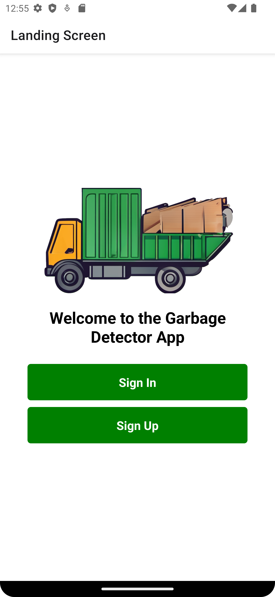 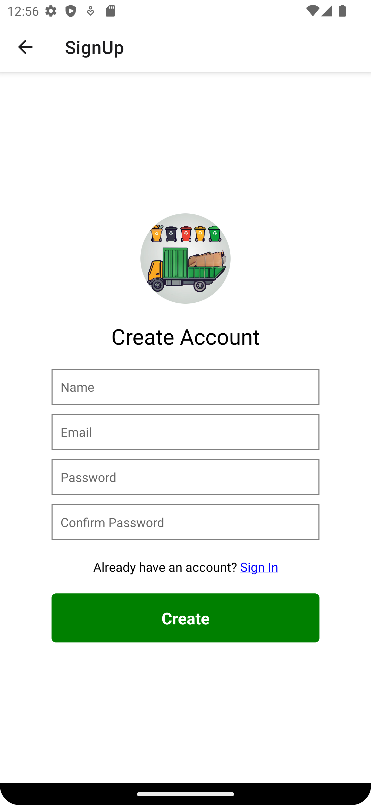 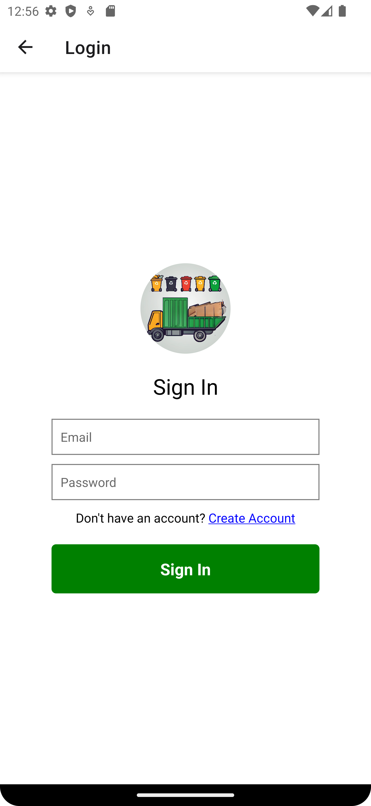 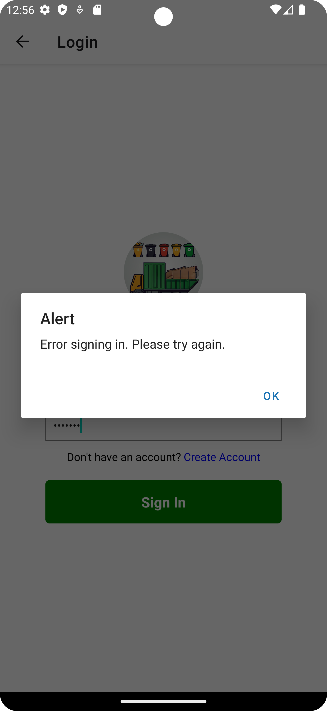 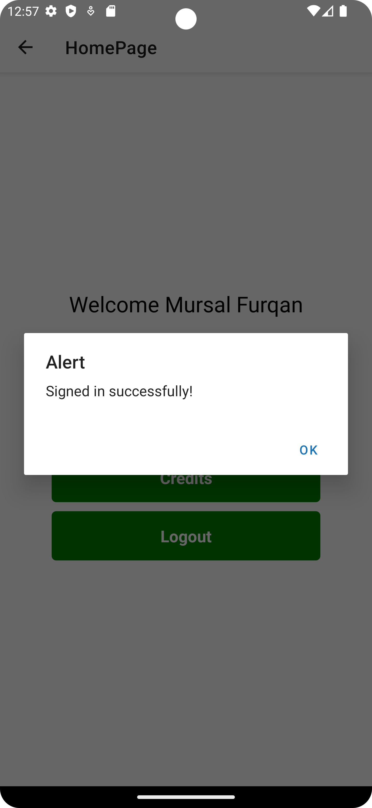 

  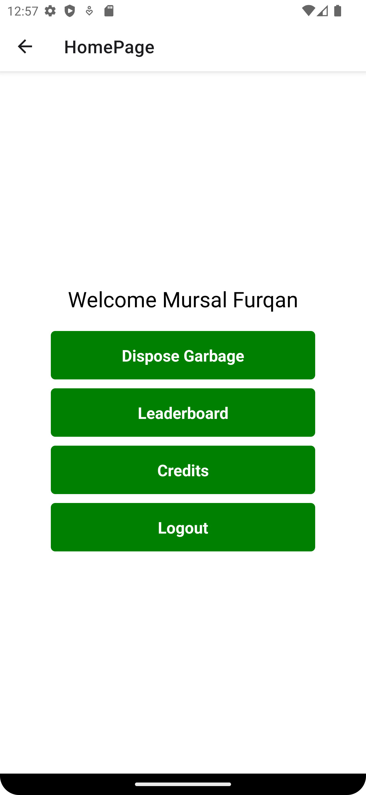 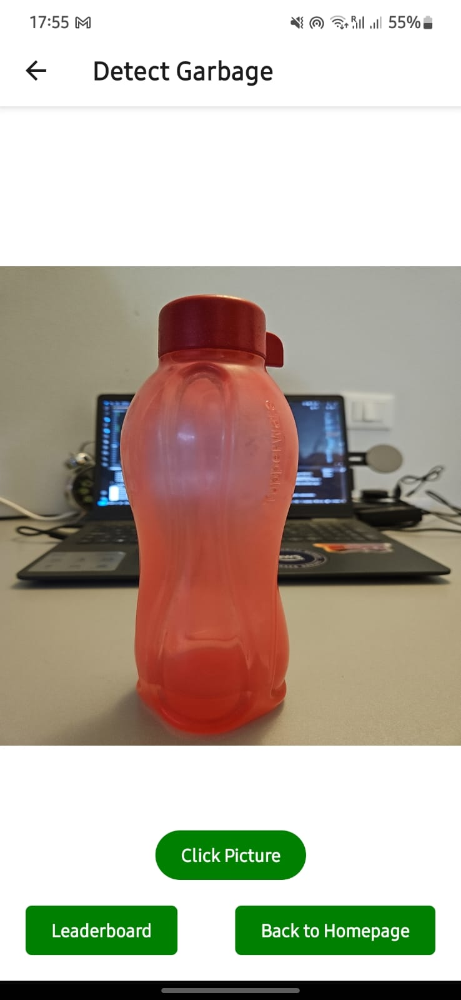 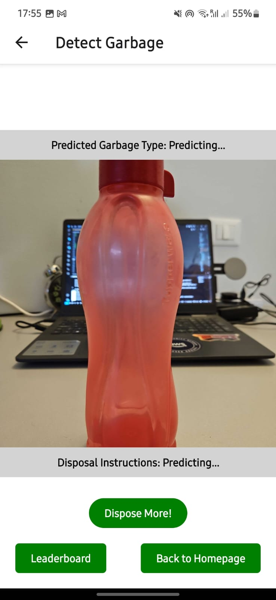 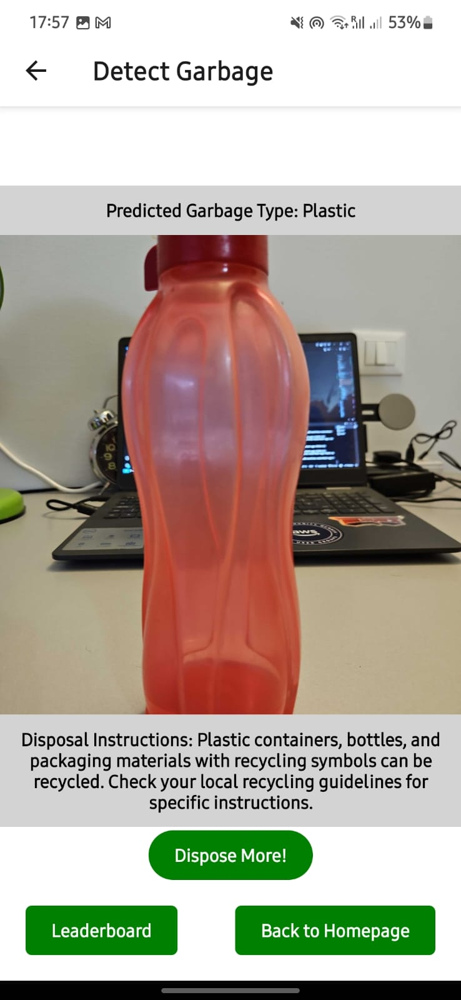
  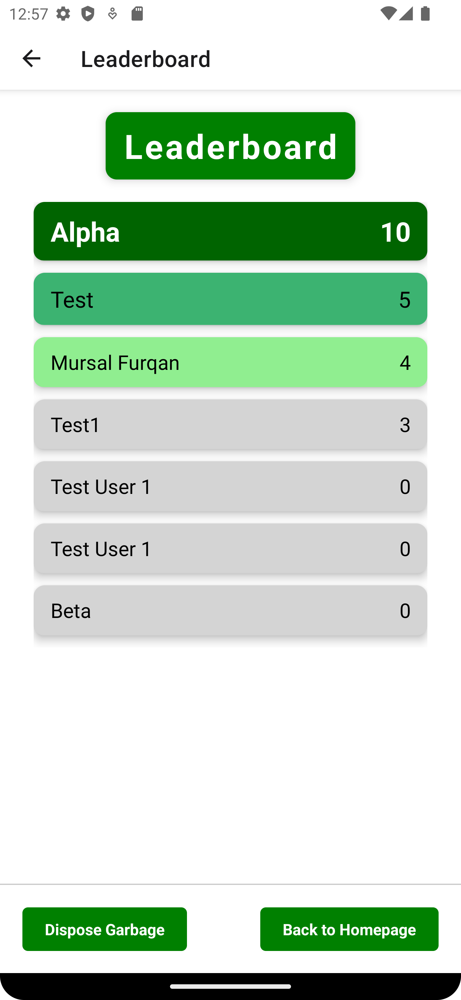 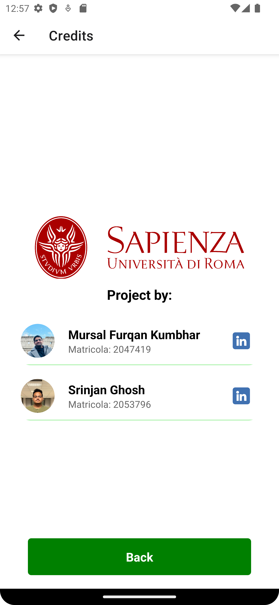 

## How to Run

1. Install an emulator (e.g., Android Studio emulator for Android or Xcode for iOS).
2. Install Expo CLI globally by running `npm install -g expo-cli`.
3. Clone this repository to your local machine.
4. Navigate to the project directory.
5. Install dependencies using `npm install` or `yarn install`.
6. Run the project using `npx expo start`.

## License

This project is licensed under the terms of the MIT license.
See [LICENSE](LICENSE) for more details.

## Contributors

- [Mursal Furqan](https://github.com/mursalfk)
- [Srinjan Ghosh](https://github.com/srinjanghosh)
